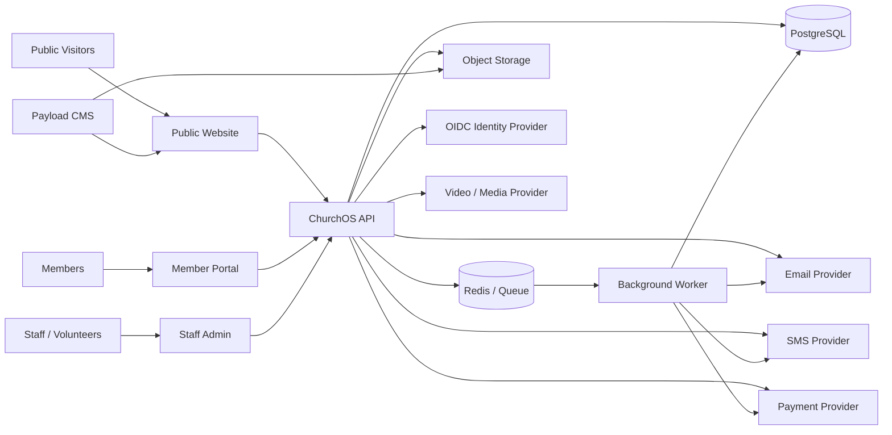

# Custom Church Management System + Website
## Research, Product Plan, GitHub Build Guide, and AI Development Instructions

**Status:** Project starter  
**Research verification date:** August 23, 2026  
**Intended use:** Commit this file to the root of the GitHub repository as the initial product and engineering blueprint.  
**Working project name:** `ChurchOS` until the church selects a final product name.

---

# 1. Executive Summary

The goal is to build a church-owned digital platform that combines:

1. A public church website and content management system.
2. A secure church management system (ChMS).
3. A member and household database.
4. Groups, events, attendance, and volunteer coordination.
5. Online giving records integrated with a payment processor.
6. Communications and follow-up workflows.
7. A member portal that can later become a PWA or native mobile app.
8. Reporting, exports, audit history, and ministry analytics.
9. A secure foundation for later modules such as children’s check-in, pastoral care, worship planning, facility scheduling, and accounting integrations.

The main strategic recommendation is **not to clone Tithely, Planning Center, Pushpay, Subsplash, or Rock RMS all at once**. Those products represent years of engineering and a very large functional surface. The church should instead build a strong shared foundation, launch a focused MVP, validate real ministry workflows, and add modules in phases.

The recommended engineering model is a **TypeScript modular monolith with clear domain boundaries**. This provides most of the benefits of a service-oriented design while remaining understandable to a volunteer or mixed-experience team.

Recommended baseline:

- **Frontend:** Next.js + TypeScript
- **Staff/admin UI:** Next.js + shared component library
- **Application API:** NestJS
- **Database:** PostgreSQL
- **ORM / schema management:** Prisma or Drizzle, select one before implementation
- **Public content CMS:** Payload CMS
- **Authentication:** Managed OpenID Connect provider
- **Authorization:** Application-owned RBAC and scoped permissions
- **Payments:** Hosted payment provider such as Stripe Checkout
- **Email:** Managed transactional email service
- **SMS:** Managed messaging provider
- **File storage:** S3-compatible object storage
- **Background jobs:** Managed queue plus worker process
- **Testing:** Vitest plus Playwright
- **Observability:** OpenTelemetry plus a hosted error/log platform
- **CI/CD:** GitHub Actions
- **Infrastructure as code:** OpenTofu
- **Source control:** GitHub organization repository with protected `main`
- **AI governance:** `AGENTS.md`, `.github/copilot-instructions.md`, path-specific instructions, required tests, and human approval for sensitive changes

The first production release should focus on:

- identity and access control
- people and households
- groups and ministry teams
- events and attendance
- website and CMS
- forms
- email communications
- giving integration and donor records
- reporting and exports
- audit logs
- data import/migration
- security, backup, restore, and operational monitoring

Children’s check-in should be included in the MVP only if the church intends to replace an existing check-in system at launch. If included, it must be implemented completely, including authorized pickup, label or code handling, security logging, role restrictions, and tested failure procedures.

---

# 2. Market Research Summary

The following comparison is based primarily on current vendor documentation and product pages reviewed in August 2026.

## 2.1 Tithely

Tithely is one of the strongest examples of an all-in-one church platform. Its church management product includes a people database, giving, volunteer management, children and event check-in, email and text messaging, groups, service planning, background checks, workflows, and reporting.

As of the research date, Tithely publicly listed:

- Church Management: approximately **$72/month**
- All Access: approximately **$119/month**
- Standalone website: approximately **$19/month**
- Standalone custom app: approximately **$89/month**
- U.S. card giving: approximately **2.9% + $0.30**
- U.S. ACH: approximately **1% + $0.30**

Tithely is useful as a model for **integration breadth**. One system owns people, communications, giving, events, and the public-facing digital experience.

### What to copy conceptually

- One person record used across every ministry module.
- Flat navigation around ministry workflows.
- Admins can work without needing deep technical expertise.
- Website, app, giving, and church records feel like one product.
- Follow-up automation is a first-class capability.

### What not to copy initially

- Full feature parity.
- A custom native mobile application before the web/member portal is successful.
- Worship planning, background checks, check-in, SMS, advanced reports, and every communication workflow in the first release.

---

## 2.2 Planning Center

Planning Center takes a modular approach. Its products cover People, Giving, Groups, Check-Ins, Calendar, Registrations, Services, Publishing, and Church Center.

Planning Center is an especially good model for:

- modular product boundaries
- granular permissions
- a central people database
- church member self-service through Church Center
- strong worship/service planning
- event registration
- secure children’s check-in
- a documented API and integration ecosystem

Planning Center publicly offers free entry tiers for several modules and prices higher tiers based on usage. At the research date, its U.S. donation processing page listed approximately:

- Card: **2.15% + $0.30**
- ACH: **$0.30 with no percentage fee**

Planning Center exposes a REST API and supports OAuth. Its API design is a useful benchmark for the custom system.

### What to copy conceptually

- Independent modules sharing a central identity/person model.
- Members can manage their own information.
- Service teams and volunteers are treated as scheduling resources.
- Check-in is a specialized, security-sensitive workflow rather than a generic attendance button.
- APIs are intentionally documented.

---

## 2.3 Pushpay / Church Community Builder

Pushpay combines giving, church management, engagement, apps, and communications. Its church management capabilities include people records, groups, attendance, volunteers, check-in, workflows, reporting, communications, service planning, and related engagement tools.

Pushpay is particularly useful as a benchmark for larger churches because it treats security, data operations, and organization-wide reporting as major product concerns.

Pushpay publicly states that products handling payment card information are PCI DSS Level 1 compliant and describes independent security audits and penetration testing.

### What to copy conceptually

- Finance data must be strongly restricted.
- Engagement history should be visible in a person profile.
- Ministry processes can be modeled as queues or workflows.
- Auditability and data security are product features, not backend-only concerns.

---

## 2.4 Subsplash

Subsplash emphasizes the church’s entire digital presence: mobile apps, websites, media, giving, church management, events, messaging, and streaming.

Its strongest differentiator is the idea of **create once, publish everywhere**. Sermons, events, content, and announcements can flow to a website, app, email, and other channels.

Subsplash is an important reference because this custom initiative includes both the church management system and the public website.

### What to copy conceptually

- Website content and church operational data should share integration points.
- Events should not be manually re-entered in several systems.
- Sermon/media metadata should be reusable across website, app, and notifications.
- A church member should have one digital identity.

### What not to build initially

- Custom video streaming/transcoding infrastructure.
- Smart TV applications.
- Native iOS/Android apps before validating member web usage.

Use a video/media provider initially and store metadata in ChurchOS.

---

## 2.5 Rock RMS

Rock RMS is strategically important because it demonstrates that a highly capable church platform can be open source and church-customizable.

Rock includes:

- people and family profiles
- attendance
- check-in
- giving and finance tools
- event registration
- workflows
- prayer
- metrics and reporting
- email and SMS
- digital publishing
- engagement tracking

Rock should be studied throughout development. The project team may find that some problems are already solved there in ways that can inform data modeling and workflows.

### Important decision point

Before committing to years of custom development, leadership should explicitly decide:

> Are we building because our ministry workflows require something meaningfully different, or because we simply prefer owning the software?

Ownership can be a valid reason, but it creates permanent responsibilities for security, backups, upgrades, support, data migration, and operational continuity.

---

## 2.6 Breeze

Breeze should no longer be evaluated as a fully separate strategic product. Tithely has publicly described Breeze as becoming part of Tithely Church Management.

Legacy Breeze remains useful as a usability benchmark because it became popular with smaller and midsized churches by keeping the interface simple.

### Lesson

**Ease of use matters more than feature count.**

A volunteer should not need a training course to:

- check someone in
- record attendance
- look up a family
- send a group message
- register a guest
- update a phone number
- view their volunteer schedule

---

# 3. Competitive Feature Matrix

Legend:

- **Strong** = mature/core capability
- **Yes** = available
- **Partial** = available but not the primary strength or may depend on package/integration
- **Build** = recommended for ChurchOS
- **Integrate** = ChurchOS should own the workflow but use a specialist provider
- **Later** = defer until after MVP

| Capability | Tithely | Planning Center | Pushpay | Subsplash | Rock RMS | ChurchOS Recommendation |
|---|---|---|---|---|---|---|
| People database | Strong | Strong | Strong | Strong | Strong | Build MVP |
| Household/family model | Yes | Yes | Yes | Yes | Yes | Build MVP |
| Custom fields/tags | Yes | Yes | Yes | Yes | Strong | Build MVP |
| Groups | Yes | Strong | Strong | Yes | Strong | Build MVP |
| Events/calendar | Yes | Strong | Yes | Strong | Strong | Build MVP |
| Registration/forms | Yes | Strong | Yes | Strong | Strong | Build MVP |
| Attendance | Yes | Yes | Yes | Yes | Strong | Build MVP |
| Children’s check-in | Yes | Strong | Strong | Yes | Strong | MVP only if required |
| Secure pickup workflow | Yes | Strong | Yes | Yes | Yes | Build with check-in |
| Volunteer scheduling | Yes | Strong | Strong | Yes | Yes | Phase 2 |
| Service/worship planning | Yes | Strong | Yes | Partial | Partial | Phase 3 |
| Giving | Strong | Strong | Strong | Strong | Strong | Integrate payment processor |
| Giving statements | Yes | Yes | Yes | Yes | Yes | Build records/statements |
| Accounting integration | Yes | Integrations | Yes | Integrations | Yes | Phase 2 |
| Email | Yes | Yes | Yes | Yes | Strong | Build UX, integrate delivery |
| SMS | Yes | Yes | Yes | Yes | Strong | Phase 2, integrate provider |
| Push notifications | App | Church Center | App | Strong | Partial | Later |
| Public website | Strong | Partial/Publishing | Partial | Strong | Strong | Build MVP on CMS |
| Sermon/media library | Yes | Publishing | Yes | Strong | Yes | Build metadata, integrate hosting |
| Native mobile app | Yes | Church Center | Yes | Strong | Partial | Later |
| Member portal | Yes | Strong | Yes | Yes | Yes | Build MVP |
| Workflows/follow-up | Yes | Yes | Strong | Yes | Strong | Phase 2 |
| Prayer requests | Partial | Forms/workflows | Yes | Yes | Strong | Phase 2 |
| Pastoral care records | Partial | Workflow dependent | Yes | Partial | Strong | Phase 2, highly restricted |
| Reporting | Yes | Strong | Strong | Yes | Strong | Build MVP basics |
| Dashboards/analytics | Yes | Yes | Strong | Yes | Strong | Phase 2 |
| API | Integrations/API | Strong | Yes | Integrations | Strong | Build from day one |
| Audit logs | Varies | Security controls | Yes | Varies | Yes | Build from day one |
| Granular permissions | Yes | Strong | Strong | Yes | Strong | Build from day one |
| Data import/export | Yes | Strong | Yes | Yes | Strong | Build MVP |
| Multi-campus | Yes | Yes | Strong | Yes | Strong | Design-ready, later UI |
| Facility scheduling | Partial | Calendar | Yes | Partial | Yes | Later |
| Background checks | Yes | Integration | Yes | Integration | Integration | Integrate only |
| Video streaming | Partial | Links/media | Partial | Strong | Integrations | Integrate only |

---

# 4. Product Principles

The team should adopt the following product rules before writing feature code.

## 4.1 One person, one record

Every module references the same canonical person record.

Do not create:

- a giving-only person table
- an attendance-only person table
- a volunteer-only person table
- a website member table separate from the ChMS person table

External systems can have mappings, but ChurchOS should maintain one internal identity.

---

## 4.2 Separate identity from ministry records

An authenticated user account is not the same thing as a person record.

Examples:

- A child can have a person record but no login.
- A guest can have a person record but no login.
- A volunteer administrator can have a login linked to a person.
- A technical service account may have a login principal but no congregant profile.

Model these separately.

---

## 4.3 Privacy by default

Access should be denied unless intentionally granted.

A small-group leader should not automatically see:

- giving history
- pastoral notes
- background-check results
- private prayer requests
- children’s security information
- staff-only notes

---

## 4.4 Build ministry workflows, buy commodity infrastructure

Build:

- people/household relationships
- ministry groups
- attendance
- event logic
- volunteer workflows
- church-specific reporting
- pastoral workflows
- member self-service
- website integration

Integrate or buy:

- payment card processing
- SMS delivery
- email delivery
- authentication infrastructure
- video encoding and streaming
- background checks
- map/geocoding services
- malware scanning
- cloud storage
- infrastructure monitoring

---

## 4.5 API-first domain design

The UI must not become the only way to interact with data.

Every major business capability should have an application service/API boundary so that later the church can support:

- native apps
- kiosks
- check-in stations
- automation
- integrations
- internal analytics
- AI assistants
- external website widgets

---

## 4.6 No production ministry data in AI prompts

Production data may reveal:

- religious affiliation
- children’s information
- contact information
- pastoral-care details
- giving history
- private prayer needs

AI tools must use synthetic fixtures unless the church has explicitly approved a secure, contracted AI data workflow.

---

# 5. Recommended MVP Scope

## 5.1 Public Website

The website is part of the platform, not a separate unrelated project.

### Required website capabilities

- Home
- About
- Beliefs / doctrine
- Leadership/staff
- Ministries
- Groups
- Events
- Sermons/media
- Give
- Visit / New Here
- Contact
- Prayer request form
- Serve / volunteer interest
- Member login
- Search
- Responsive/mobile design
- SEO metadata
- Open Graph/social metadata
- Sitemap
- Robots configuration
- Accessibility baseline
- Analytics
- Draft and publish workflows

### CMS roles

- Site administrator
- Content editor
- Ministry content editor
- Media editor
- Publisher

Do not grant ChMS administrative access simply because someone can edit website content.

---

## 5.2 People and Households

### Person fields

Core:

- UUID
- first name
- preferred name
- middle name
- last name
- suffix
- date of birth
- gender if the church chooses to store it
- primary email
- primary phone
- address
- status
- membership status
- campus
- profile photo
- created/updated timestamps
- source/import metadata

Optional ministry fields:

- baptism date
- membership date
- salvation/testimony milestones
- classes completed
- ministry interests
- spiritual gifts
- custom tags

Keep theological/ministry fields configurable so the database can match the church’s actual discipleship process.

### Household

A household should support:

- household name
- primary address
- members
- relationship type
- household roles
- primary contacts
- children/dependents
- inactive/archived households

Do not infer relationships automatically from last name.

---

## 5.3 Groups

Group types may include:

- small groups
- Bible studies
- ministry teams
- classes
- volunteer teams
- care teams
- leadership teams

Core group capabilities:

- name
- description
- leader(s)
- members
- capacity
- meeting schedule
- location
- privacy level
- join/request-to-join
- attendance
- communication
- tags
- status
- start/end dates

---

## 5.4 Events and Calendar

Core capabilities:

- recurring and one-time events
- public/private visibility
- registration
- capacity
- waitlist later
- custom questions
- payment-required flag
- locations
- ministry owner
- calendar feed
- attendance
- reminders
- website publishing

Events must be the canonical source for public website event listings.

Do not maintain a separate website calendar database.

---

## 5.5 Forms

A general form engine reduces one-off development.

Initial field types:

- text
- email
- phone
- textarea
- date
- select
- multi-select
- checkbox
- yes/no
- person lookup for staff forms
- consent checkbox

Forms should support:

- public form
- authenticated member form
- staff-only form
- event-linked form
- group-linked form
- workflow trigger
- email notification
- export

---

## 5.6 Giving

ChurchOS should own:

- funds
- donor linkage
- transaction metadata
- contribution history
- recurring-gift status metadata
- offline cash/check entries
- batches
- statements
- exports
- reconciliation status
- payment-provider mapping
- audit history

ChurchOS should **not** store raw card numbers, CVVs, or bank account credentials.

### Recommended payment architecture

Use a hosted payment flow such as Stripe Checkout.

Flow:

1. Member selects amount and fund in ChurchOS.
2. ChurchOS creates a checkout session with the payment provider.
3. Donor enters payment data on the provider-hosted page or provider-controlled component.
4. Provider processes the payment.
5. Provider sends a signed webhook to ChurchOS.
6. ChurchOS verifies the signature.
7. ChurchOS stores the resulting non-sensitive transaction metadata.
8. A background worker processes receipts, donor matching, and notifications.
9. Finance staff reconcile deposits and funds.

Never mark a donation successful based only on a browser redirect.

The signed payment webhook is the authoritative event.

---

## 5.7 Member Portal

The MVP member portal should allow members to:

- log in
- update allowed contact information
- manage communication preferences
- view household information they are authorized to view
- view groups
- view upcoming events
- register for events
- submit forms
- access giving history
- download giving statements when available
- view serving opportunities later

---

## 5.8 Reporting and Export

Initial reports:

- active people
- member/attendee status
- household counts
- attendance by event
- attendance trends
- group membership
- group attendance
- new people
- event registrations
- giving by fund
- giving by period
- donor statements
- failed/import-error records
- communication opt-outs
- user/admin access report

Every major table should support CSV export subject to permission.

Exports containing sensitive data must be audited.

---

# 6. Phase 2 Capabilities

After the MVP has real users and stable operations:

- volunteer scheduling
- availability and blackout dates
- automated reminders
- SMS
- guest follow-up workflows
- prayer requests
- pastoral-care cases
- background-check integration
- QuickBooks Online integration
- dashboards
- saved reports
- advanced filtering
- member directory with opt-in privacy controls
- task/workflow engine
- email templates
- automatic new-guest sequences
- child check-in if not part of MVP
- label printing
- room capacity
- check-in kiosk mode

---

# 7. Phase 3 Capabilities

- worship/service planning
- song library
- service order
- team scheduling
- sermon notes
- advanced discipleship pathways
- facility and room scheduling
- resource reservations
- multi-campus administration
- advanced pastoral care
- advanced analytics
- mobile push notifications
- PWA offline workflows
- native mobile app only if usage justifies it
- deeper accounting automation
- data warehouse / BI
- AI-assisted staff search against permission-filtered data
- AI-assisted content drafting with strict privacy boundaries

---

# 8. Proposed System Architecture

## 8.1 Architecture style

Use a **modular monolith**.

This means:

- one deployable application API initially
- one canonical relational database
- clear internal modules
- domain events between modules
- background jobs for slow/external work
- external integrations behind adapters

Do not begin with microservices.

Microservices would add:

- service discovery
- distributed tracing requirements
- inter-service authorization
- duplicated deployment pipelines
- data consistency problems
- more difficult local development
- more difficult volunteer onboarding

Move a module to a service only if real scale or reliability data later justifies it.

---

## 8.2 Logical architecture



---

## 8.3 Recommended monorepo

```text
/
├─ apps/
│  ├─ web/                  # Public website + member-facing Next.js
│  ├─ admin/                # Staff/admin Next.js
│  ├─ api/                  # NestJS application API
│  ├─ worker/               # Background jobs
│  └─ cms/                  # Payload CMS
│
├─ packages/
│  ├─ db/                   # schema, migrations, DB utilities
│  ├─ domain/               # shared domain types and rules
│  ├─ auth/                 # authorization policies/helpers
│  ├─ ui/                   # reusable UI components
│  ├─ api-client/           # generated/typed client
│  ├─ config/               # eslint, tsconfig, env validation
│  ├─ observability/        # logging/tracing helpers
│  └─ test-utils/           # fixtures/builders
│
├─ infrastructure/
│  ├─ modules/
│  ├─ environments/
│  │  ├─ dev/
│  │  ├─ staging/
│  │  └─ prod/
│  └─ README.md
│
├─ docs/
│  ├─ architecture/
│  ├─ adr/
│  ├─ security/
│  ├─ runbooks/
│  ├─ data-model/
│  └─ product/
│
├─ scripts/
│  ├─ import/
│  ├─ maintenance/
│  └─ seed/
│
├─ .github/
│  ├─ workflows/
│  ├─ ISSUE_TEMPLATE/
│  ├─ instructions/
│  ├─ CODEOWNERS
│  ├─ copilot-instructions.md
│  └─ pull_request_template.md
│
├─ AGENTS.md
├─ CONTRIBUTING.md
├─ SECURITY.md
├─ README.md
└─ package.json
```

Use `pnpm` workspaces. Turborepo is optional but useful if the repo grows.

---

# 9. Domain Model

The exact schema should be decided through migrations and ADRs, but the following model is a strong starting point.

## 9.1 Identity and authorization

- `users`
- `external_identities`
- `user_person_links`
- `roles`
- `permissions`
- `user_roles`
- `role_permissions`
- `resource_scopes`
- `sessions_metadata` if needed
- `audit_events`

## 9.2 People

- `people`
- `person_emails`
- `person_phones`
- `addresses`
- `households`
- `household_members`
- `person_tags`
- `tags`
- `custom_field_definitions`
- `custom_field_values`
- `person_status_history`

## 9.3 Groups

- `groups`
- `group_types`
- `group_members`
- `group_roles`
- `group_meetings`
- `group_attendance`

## 9.4 Events

- `events`
- `event_occurrences`
- `event_locations`
- `event_registration_types`
- `event_registrations`
- `event_registration_answers`
- `event_attendance`

## 9.5 Forms

- `forms`
- `form_versions`
- `form_fields`
- `form_submissions`
- `form_answers`

Never mutate the schema of an already-submitted form version in a way that makes old submissions unreadable.

Version forms.

## 9.6 Giving

- `funds`
- `donors`
- `contributions`
- `contribution_allocations`
- `payment_provider_transactions`
- `payment_provider_customers`
- `giving_batches`
- `batch_items`
- `deposit_reconciliations`
- `giving_statements`

## 9.7 Communications

- `communication_preferences`
- `communication_lists`
- `communication_list_members`
- `messages`
- `message_recipients`
- `message_delivery_events`
- `templates`
- `unsubscribe_events`

## 9.8 Content

CMS may own these records separately, but common content concepts include:

- pages
- sermons
- sermon_series
- speakers
- ministries
- announcements
- media_assets
- navigation
- redirects

## 9.9 Pastoral care, later phase

Use a separate restricted domain.

- `care_cases`
- `care_case_participants`
- `care_notes`
- `care_tasks`
- `prayer_requests`
- `prayer_visibility`

Pastoral notes should never be treated as generic person notes.

---

# 10. Authentication and Authorization

## 10.1 Authentication

Do not build password storage and password-reset infrastructure from scratch.

Use a managed OpenID Connect provider.

Requirements:

- MFA for staff/admin accounts
- account recovery
- secure session management
- email verification
- brute-force protection
- OIDC/OAuth standards
- future social or Google Workspace login if desired

## 10.2 Authorization

Authentication answers:

> Who are you?

Authorization answers:

> What are you allowed to do?

ChurchOS owns authorization.

Recommended permission naming:

```text
people.read
people.write
people.export
households.read
groups.manage
events.manage
attendance.record
giving.read
giving.manage
giving.export
communications.send
cms.edit
cms.publish
care.read
care.write
checkin.operate
checkin.admin
admin.users
admin.roles
audit.read
```

Support scope:

```text
organization
campus
ministry
group
self
household
```

Example:

A small-group leader may have:

```text
people.read scope=group:<group-id>
attendance.record scope=group:<group-id>
communications.send scope=group:<group-id>
```

They do not receive organization-wide `people.read`.

---

# 11. Sensitive Data Classification

Create a formal data classification document.

## Public

- published sermons
- public events
- public staff bios
- public ministry descriptions

## Internal

- staff scheduling
- internal ministry documents
- non-sensitive operational data

## Confidential

- member contact details
- household records
- attendance history
- donation history
- internal notes
- form submissions

## Highly Restricted

- children’s security/check-in information
- pastoral care notes
- background-check information
- financial account configuration
- authentication secrets
- API keys
- security incident details

Highly Restricted data requires explicit permissions and stronger logging.

---

# 12. Giving and PCI Strategy

A church accepting cards participates in PCI DSS responsibilities.

The application should reduce scope rather than attempting to become a card-data processor.

## Rules

1. Never log card numbers.
2. Never store CVV.
3. Never create custom card-entry HTML fields that send raw PAN data through ChurchOS.
4. Prefer provider-hosted checkout.
5. Validate webhook signatures.
6. Store provider IDs, status, amount, currency, fund, donor mapping, and timestamps.
7. Make webhook processing idempotent.
8. Record refunds and disputes as separate financial events.
9. Restrict finance permissions.
10. Audit every sensitive finance export.

Stripe documents Checkout as a hosted or embedded provider-controlled payment experience and recommends low-risk integrations that send sensitive payment data directly to Stripe rather than through the application server.

---

# 13. Communications Architecture

## Email

ChurchOS should own:

- recipient selection
- templates
- permission checks
- communication preferences
- campaign metadata
- delivery status
- unsubscribe status
- audit logs

The email provider should own:

- SMTP/API delivery
- bounce handling
- reputation infrastructure
- delivery network

Candidates include Amazon SES, Postmark, SendGrid, Mailgun, or a similar provider.

Select one based on deliverability, nonprofit pricing, API quality, and operational simplicity.

## SMS

Do not build telecom delivery.

Use a provider such as Twilio or another compliant messaging vendor.

ChurchOS must track:

- explicit opt-in
- opt-out
- STOP status
- purpose/category consent
- message audit history

U.S. application-to-person messaging has registration and consent obligations. Treat SMS as a Phase 2 capability.

---

# 14. Website and CMS Strategy

Use Payload CMS or another self-hostable headless CMS rather than building an editor from scratch.

Recommended content architecture:

```text
Page
Ministry
StaffProfile
Sermon
SermonSeries
Speaker
Announcement
Location
FAQ
Navigation
Redirect
MediaAsset
```

Events should normally come from the ChurchOS event domain, not be duplicated as manually entered CMS content.

Groups shown publicly should come from the group domain using a public projection.

Giving pages should be ChurchOS pages that initiate a provider-hosted payment session.

---

# 15. Mobile Strategy

## MVP

Responsive web application.

## Phase 2

Installable PWA if member usage supports it.

Useful PWA targets:

- member portal
- staff attendance
- check-in helper
- volunteer schedule

## Phase 3+

Native iOS/Android only after identifying requirements that cannot be met well through the PWA, such as:

- robust push notifications
- Bluetooth peripherals
- advanced offline check-in
- app-store presence as a strategic ministry goal

Do not create native apps merely because commercial competitors have them.

---

# 16. Children’s Check-In Architecture

Check-in is a security system.

If implemented, it needs a dedicated threat model.

Core records:

- child person record
- authorized household/guardians
- event occurrence
- room
- check-in record
- pickup authorization token/code
- check-out event
- operator
- label metadata
- incident flag

Required controls:

- staff/volunteer permission
- no public child search
- security code not predictable
- secure pickup match
- operator audit log
- reprint logging
- manual override requires elevated permission
- emergency roster
- room capacity
- health/allergy data only if leadership approves storing it
- printed labels should minimize sensitive information

Do not ship a partial children’s security workflow.

---

# 17. File and Media Strategy

Use object storage.

Store:

- profile photos
- form attachments
- downloadable resources
- generated statements
- approved internal files

Controls:

- private by default
- signed short-lived URLs
- MIME validation
- file-size limits
- malware scanning for uploads
- no executable uploads
- encryption at rest
- metadata in PostgreSQL

For sermons/video:

Use YouTube, Vimeo, Mux, or the church’s chosen streaming provider.

ChurchOS should initially store:

- title
- description
- speaker
- date
- series
- scripture references
- thumbnail
- external video ID/URL
- audio link if available

Avoid building video transcoding/CDN infrastructure during MVP.

---

# 18. Observability

Production software needs to answer:

- Is the site up?
- Are users receiving errors?
- Did giving webhooks fail?
- Are emails failing?
- Did a deployment cause regression?
- Is the database nearing capacity?
- Are background jobs stuck?
- Are there suspicious admin actions?

Implement:

- structured logs
- request IDs
- user/action IDs where appropriate
- traces
- metrics
- error tracking
- uptime monitoring
- queue monitoring
- database health monitoring

Never log highly sensitive payloads.

Suggested pattern:

OpenTelemetry instrumentation plus a hosted monitoring/error platform.

---

# 19. Backups and Disaster Recovery

Minimum production requirements:

## Database

- automated daily backups
- point-in-time recovery where supported
- backup retention policy
- encrypted backups
- separate production credentials

## Object storage

- versioning where appropriate
- lifecycle policy
- accidental-delete protection

## Restore testing

A backup that has never been restored is not a complete backup strategy.

Perform documented restore tests at least quarterly.

Create runbooks:

```text
docs/runbooks/database-restore.md
docs/runbooks/production-outage.md
docs/runbooks/payment-webhook-failure.md
docs/runbooks/security-incident.md
docs/runbooks/account-lockout.md
```

Define recovery targets:

- RPO: acceptable data loss window
- RTO: acceptable service restoration time

Leadership should approve both.

---

# 20. Accessibility

The church website and member workflows should target WCAG 2.2 AA practices.

Include:

- keyboard navigation
- visible focus states
- semantic HTML
- form labels
- descriptive error messages
- color contrast
- reduced-motion support
- alt text
- captions/transcripts for media when available
- accessible dialogs
- screen-reader testing on critical workflows

Accessibility must be part of the Definition of Done.

---

# 21. API Strategy

Use REST initially unless the team has a compelling reason for GraphQL.

Use OpenAPI for API documentation and client generation.

Suggested routes:

```text
/api/v1/people
/api/v1/households
/api/v1/groups
/api/v1/events
/api/v1/attendance
/api/v1/forms
/api/v1/giving
/api/v1/communications
/api/v1/users
/api/v1/roles
/api/v1/audit
```

Rules:

- UUID identifiers
- pagination
- consistent errors
- validation
- authorization at service boundary
- request IDs
- idempotency keys for sensitive commands
- API versioning
- OpenAPI generated from source
- rate limiting for public endpoints

Do not expose ORM models directly as the public API contract.

---

# 22. Domain Events

Even in a modular monolith, publish internal events.

Examples:

```text
person.created
person.updated
household.updated
group.member_added
event.registration_created
attendance.recorded
donation.succeeded
donation.failed
donation.refunded
form.submitted
communication.requested
communication.delivered
member.first_visit
```

Consumers can trigger:

- email
- workflow tasks
- analytics
- integrations
- notifications

Use an outbox pattern before relying on events for financially or operationally critical workflows.

---

# 23. Database Migration Rules

Database changes are high-risk.

Required rules:

1. Migrations are committed to Git.
2. Never modify an already-applied production migration.
3. Prefer backward-compatible additive changes.
4. Separate schema migrations from large data backfills.
5. Backfills must be restartable.
6. Large updates must be batched.
7. Destructive migrations require explicit human review.
8. Production migrations run through CI/CD, not from a developer laptop.
9. Every migration includes rollback or forward-recovery notes.
10. Never use production data as AI input while debugging a migration.

Safe pattern:

Phase A:
- add nullable field/table
- deploy compatible application

Phase B:
- backfill data
- monitor

Phase C:
- switch application reads/writes

Phase D:
- enforce constraints

Phase E:
- later remove deprecated field after verification

---

# 24. Data Import and Migration

Build import tooling as a product capability, not a one-time script.

Likely source formats:

- CSV exports
- Planning Center export/API
- Tithely export/API
- Breeze/Tithely legacy exports
- Pushpay/CCB exports
- spreadsheets
- current website CMS export

Import pipeline:


Never import directly into production canonical tables without validation.

Every import should produce:

- source row count
- accepted row count
- rejected row count
- duplicates detected
- mappings used
- warnings
- checksum/source file identifier
- operator
- timestamp

Keep source export files in restricted storage for an approved retention period.

---

# 25. Testing Strategy

## Unit tests

Test:

- domain rules
- permission checks
- donor matching
- recurrence logic
- household relationships
- workflow state
- validation

## Integration tests

Test:

- API + database
- migrations
- authorization
- payment webhook verification
- email queue behavior
- import pipeline

## End-to-end tests

Playwright workflows:

- visit website
- member login
- update profile
- create event
- register for event
- record attendance
- submit form
- initiate giving test flow
- admin views contribution
- export permission denied for unauthorized role

## Security regression tests

Include explicit tests proving:

- group leader cannot see giving
- finance user cannot see pastoral notes unless separately authorized
- unauthenticated user cannot query private people
- member cannot edit another household without authorization
- child record is not publicly enumerable
- cross-campus/ministry scope restrictions work

Authorization tests are mandatory.

---

# 26. Environments

Maintain:

```text
local
test
development/shared
staging
production
```

Never use production as a test environment.

Use synthetic seed data.

Example fake people:

```text
Alex Example
Jordan Example
Taylor Example
Morgan Example
```

Do not copy real congregation data into lower environments unless it is properly de-identified and leadership has approved the process.

---

# 27. CI/CD

Every pull request should run:

1. dependency install
2. formatting check
3. lint
4. TypeScript type check
5. unit tests
6. integration tests
7. build
8. migration validation
9. security/dependency scan
10. selected Playwright tests

`main` deployment:

- deploy staging automatically
- run smoke tests
- production deploy requires protected environment approval initially

Use GitHub Actions OIDC to obtain short-lived cloud credentials instead of storing long-lived cloud keys in repository secrets whenever the selected cloud supports it.

---

# 28. GitHub Operating Model

## 28.1 Repository ownership

Create the repository in a GitHub organization owned by the church, not in one volunteer’s personal account.

At least two church-controlled administrators should exist.

Enable:

- MFA
- recovery procedures
- least privilege
- protected `main`
- security alerts
- Dependabot where appropriate

## 28.2 Branch model

Use trunk-based development.

```text
main
feature/123-person-search
fix/245-event-timezone
chore/312-upgrade-next
```

Avoid:

- long-lived `develop`
- month-long feature branches
- direct pushes to `main`

## 28.3 Pull requests

Required:

- linked issue
- clear description
- tests
- screenshots for UI changes
- migration notes
- security/privacy impact
- reviewer

Sensitive changes require a human domain reviewer:

- auth
- permissions
- giving/payments
- database migrations
- pastoral care
- child check-in
- infrastructure
- production secrets

## 28.4 Merge strategy

Prefer squash merging.

Commit history on feature branches can be messy; `main` should remain understandable.

---

# 29. Suggested CODEOWNERS

Replace placeholders with real GitHub teams.

```text
# Default
* @church-tech/core

# Repository governance
/.github/ @church-tech/leads
/AGENTS.md @church-tech/leads
/SECURITY.md @church-tech/security

# Authentication and authorization
/packages/auth/ @church-tech/security
/apps/api/src/modules/auth/ @church-tech/security

# Database and migrations
/packages/db/ @church-tech/data
/packages/db/migrations/ @church-tech/data @church-tech/security

# Giving
/apps/api/src/modules/giving/ @church-tech/finance-tech @church-tech/security

# Pastoral care
/apps/api/src/modules/care/ @church-tech/pastoral-tech @church-tech/security

# Check-in
/apps/api/src/modules/checkin/ @church-tech/checkin @church-tech/security

# Infrastructure
/infrastructure/ @church-tech/platform @church-tech/security

# Public website
/apps/web/ @church-tech/web

# CMS
/apps/cms/ @church-tech/web
```

Require code-owner approval for sensitive paths where GitHub plan/settings allow.

---

# 30. Issue Template

Create `.github/ISSUE_TEMPLATE/feature.yml` or a Markdown equivalent.

Suggested fields:

```markdown
## Problem

What ministry or user problem are we solving?

## User

Who needs this?

## Proposed outcome

Describe behavior, not implementation.

## Acceptance criteria

- [ ]
- [ ]
- [ ]

## Security/privacy impact

What data is read, written, exported, or disclosed?

## Roles/permissions

Who may perform this action?

## Data model impact

Does this require schema changes?

## UX notes

Screens, states, mobile behavior, accessibility.

## Out of scope

What should not be built in this issue?

## Test scenarios

List required tests.
```

---

# 31. Pull Request Template

Create `.github/pull_request_template.md`:

```markdown
## Summary

## Linked issue

Closes #

## Changes

## Screenshots

## Security / privacy

- [ ] No secrets added
- [ ] No production PII used
- [ ] Permission behavior reviewed
- [ ] Sensitive logs reviewed

## Database

- [ ] No schema change
- [ ] Migration included
- [ ] Backfill plan included if needed
- [ ] Roll-forward/rollback notes included

## Testing

- [ ] Unit
- [ ] Integration
- [ ] E2E where appropriate
- [ ] Manual verification

Commands run:

```text
pnpm lint
pnpm typecheck
pnpm test
pnpm build
```

## AI assistance

Describe any AI-generated portions and what was manually verified.

## Deployment notes
```

---

# 32. Architecture Decision Records

Create ADRs under:

```text
docs/adr/
```

Naming:

```text
0001-modular-monolith.md
0002-postgresql.md
0003-managed-oidc.md
0004-hosted-payment-checkout.md
0005-payload-cms.md
0006-rest-openapi.md
```

ADR template:

```markdown
# ADR ####: Title

Status: Proposed | Accepted | Superseded
Date:

## Context

## Decision

## Alternatives considered

## Consequences

## Security/privacy impact

## Revisit when
```

AI should not silently change an accepted architecture decision.

---

# 33. Repository-Level AI Instructions

Create an `AGENTS.md` file containing rules similar to the following.

## AI Operating Rules

### Before modifying code

1. Read `README.md`.
2. Read `AGENTS.md`.
3. Read relevant ADRs.
4. Read the nearest path-specific `AGENTS.md` if present.
5. Inspect the code around the requested change.
6. Inspect tests for that module.
7. Inspect the current database schema before proposing schema changes.
8. Inspect the OpenAPI contract before inventing routes or fields.
9. Search the repository before creating a new abstraction.
10. State a short implementation plan.

### Scope

- Implement only the issue requested.
- Do not perform unrelated refactors.
- Do not rename public APIs without explicit instruction.
- Do not replace a dependency merely because another library is preferred.
- Keep pull requests reviewable.

### Security

- Never add secrets.
- Never output or commit `.env` credentials.
- Never use real congregant PII in tests, fixtures, screenshots, or prompts.
- Treat giving, children, pastoral care, and authentication as sensitive domains.
- Enforce authorization server-side.
- Never rely on hidden UI controls as authorization.
- Never weaken security to make tests pass.
- Never disable validation globally.
- Never log access tokens, passwords, raw payment data, or pastoral notes.

### Data model

- Never invent a column or relation without checking the schema.
- Never change an applied migration.
- Generate a new migration.
- Prefer additive migrations.
- Explain destructive operations.
- Keep data migrations restartable and idempotent where practical.

### External APIs

- Do not invent provider endpoints, request fields, event names, or webhook payloads.
- Verify against vendor documentation or existing integration code.
- Isolate external providers behind adapters.
- Handle timeouts and retries.
- Verify webhook signatures.
- Make webhook consumers idempotent.

### Tests

For each behavioral change:

- add or update unit tests
- add integration tests when database/API behavior changes
- add E2E coverage for critical user flows
- include negative authorization tests
- test failure states
- run the documented validation commands

### Documentation

Update documentation when changing:

- architecture
- environment variables
- API contracts
- database model
- security behavior
- operational process

Create or update an ADR for architectural changes.

### Completion

Before claiming completion:

1. Review the diff.
2. Ensure no unrelated files changed.
3. Run formatter.
4. Run lint.
5. Run type check.
6. Run tests.
7. Run build.
8. Report any command that could not be run.
9. Summarize security/data implications.
10. Provide migration/deployment notes.

### AI must never merge its own sensitive change

Changes involving auth, permissions, giving, migrations, children, pastoral care, or production infrastructure require human review.

---

# 34. Suggested `.github/copilot-instructions.md`

```markdown
# ChurchOS Copilot Instructions

ChurchOS contains sensitive church data. Treat all people, household, attendance,
giving, children, pastoral-care, and communication records as confidential.

Before coding:
- read AGENTS.md
- inspect relevant ADRs
- inspect existing implementation and tests
- inspect database schema and API definitions
- do not invent fields, endpoints, provider APIs, or permissions

Architecture:
- maintain the modular-monolith boundaries
- business rules belong in domain/application services, not React components
- authorization must be enforced server-side
- external vendors must be isolated behind adapters
- use domain events for cross-module side effects

Security:
- never commit secrets
- never use production PII
- never log payment data, passwords, tokens, pastoral notes, or restricted child data
- use least privilege
- include negative authorization tests for sensitive endpoints

Database:
- never edit an applied migration
- prefer additive backward-compatible migrations
- describe destructive changes and backfills

Quality:
- keep changes scoped to the issue
- write tests for changed behavior
- update documentation for contract/architecture changes
- run lint, typecheck, tests, and build before completion

Pull request summaries must include:
- what changed
- why
- tests run
- schema/migration impact
- permissions/security impact
- deployment notes
```

---

# 35. Path-Specific AI Instructions

Examples:

`.github/instructions/giving.instructions.md`

```markdown
---
applyTo: "apps/api/src/modules/giving/**,packages/db/**/*giving*"
---

This domain handles financial records.

- never handle raw card numbers or CVV
- provider webhooks are authoritative for payment completion
- verify webhook signatures
- make event handling idempotent
- preserve immutable financial history
- refunds and reversals are separate events, not silent edits
- require finance permissions for sensitive reads/exports
- add audit events for finance exports and administrative changes
```

`.github/instructions/care.instructions.md`

```markdown
---
applyTo: "apps/api/src/modules/care/**"
---

Pastoral-care data is Highly Restricted.

- do not return care notes from generic person endpoints
- every read requires explicit care permission
- log access to restricted records
- never expose notes through public search, member directory, group APIs, or analytics
- use synthetic care records in tests
```

---

# 36. AI Prompt Library

## 36.1 Feature implementation prompt

```text
Implement GitHub issue #___.

Before editing:
1. Read AGENTS.md.
2. Read relevant ADRs.
3. Inspect the current module, schema, API contract, and tests.
4. Search for existing patterns we should reuse.
5. Give a concise implementation plan.

Constraints:
- Keep changes scoped to the issue.
- Do not invent schema fields or external API behavior.
- Enforce authorization server-side.
- Use synthetic test data only.
- Add tests for success, failure, and permission-denied cases.
- Do not modify an existing production migration.

At completion:
- run format/lint/typecheck/tests/build
- summarize files changed
- identify schema/security/privacy impact
- provide deployment notes
- call out anything not verified
```

## 36.2 Bug-fix prompt

```text
Investigate issue #___.

Do not patch the symptom first.

1. Reproduce the problem with a failing test if possible.
2. Trace the request through UI, API, domain service, and database.
3. Identify the root cause.
4. Propose the smallest safe fix.
5. Implement it.
6. Keep the regression test.
7. Run the relevant test suite.

Do not weaken validation, authorization, or error handling to make the test pass.
```

## 36.3 Test-generation prompt

```text
Review this module for missing tests.

Focus on:
- authorization boundaries
- invalid input
- not-found behavior
- duplicate/retry behavior
- concurrency where relevant
- audit logging
- privacy leakage
- timezone/date edge cases

Do not write tests that simply mirror the implementation.
Write tests around externally observable behavior and domain invariants.
```

## 36.4 Security-review prompt

```text
Perform a skeptical security review of this pull request.

Look specifically for:
- missing authorization
- insecure direct object references
- cross-group/cross-campus data leakage
- mass assignment
- unsafe file upload
- injection
- XSS
- CSRF assumptions
- secret exposure
- sensitive logging
- webhook spoofing
- replay/idempotency errors
- weak child check-in controls
- finance/pastoral data exposure

Rank findings by severity.
For each finding, include file/location, exploit scenario, and recommended remediation.
Do not invent vulnerabilities that are not supported by the code.
```

## 36.5 Migration prompt

```text
We need to change the database to support: ___.

Before proposing a migration:
- inspect the current schema
- inspect existing migrations
- identify production compatibility risks

Prefer an expand/migrate/contract approach.

Provide:
1. schema change
2. migration
3. backfill plan if needed
4. application compatibility plan
5. rollback or forward-recovery plan
6. validation query/tests

Never modify an already-applied migration.
```

## 36.6 Documentation prompt

```text
Update repository documentation for the change in PR #___.

Inspect the code and diff first.

Update only documentation affected by the actual implementation:
- README
- API docs
- ADRs
- environment variables
- runbooks
- architecture diagrams
- user/admin behavior

Do not document features that the code does not implement.
```

---

# 37. Definition of Done

A feature is not done when the UI works on one developer laptop.

A feature is done when:

- acceptance criteria are met
- authorization is implemented
- validation is implemented
- tests pass
- accessibility reviewed
- mobile layout reviewed
- audit requirements implemented
- observability exists
- error states exist
- docs updated
- migration is safe
- no secrets/PII added
- PR reviewed
- staging verified

Critical workflows should also have a runbook.

---

# 38. First 30 Days

The first month should establish foundations and deliver one working vertical slice.

## Days 1-5: Governance and discovery

### Leadership decisions

Document:

- church legal owner of software
- product owner
- technical lead
- security lead
- finance representative
- pastoral representative
- check-in/children representative if applicable
- final approvers for production access
- target launch scope
- current systems being replaced
- current data sources
- current website/CMS
- current giving provider
- current accounting system
- single vs multi-campus requirement
- expected people records
- expected weekly check-ins
- expected monthly gifts
- SMS requirement
- check-in launch requirement

### Repository setup

Create:

- GitHub organization/team structure
- private repository
- `README.md`
- `AGENTS.md`
- `CONTRIBUTING.md`
- `SECURITY.md`
- `CODEOWNERS`
- issue templates
- PR template
- branch protection
- CI skeleton

### ADRs

Accept initial ADRs:

- modular monolith
- PostgreSQL
- REST/OpenAPI
- managed authentication
- hosted payment processing
- CMS

---

## Days 6-10: Development platform

Build:

- monorepo
- local Docker database
- environment validation
- API health endpoint
- database migration pipeline
- logging
- error handling
- auth provider integration in dev
- base RBAC
- admin shell
- public site shell
- CMS shell
- CI

Goal:

A contributor can clone the repo, run one documented setup command, and load the website/admin API locally.

---

## Days 11-15: People vertical slice

Build:

- person schema
- household schema
- staff person list
- person detail
- household detail
- search
- create/update
- permission checks
- audit events
- synthetic fixtures
- CSV import prototype
- tests

Goal:

Authorized staff can manage people and households end to end.

---

## Days 16-20: Website + CMS vertical slice

Build:

- homepage
- ministry page model
- staff model
- sermon model
- navigation
- SEO
- responsive layouts
- CMS editor roles
- content publishing workflow

Goal:

A non-developer can publish approved website content.

---

## Days 21-25: Events and forms

Build:

- events
- occurrences
- public event listing
- registration
- basic form engine
- admin registration list
- attendance recording
- tests

Goal:

A visitor can view an event, register, and staff can record attendance.

---

## Days 26-30: Hardening and pilot

Complete:

- authorization review
- data classification review
- backup configuration
- restore test
- staging environment
- monitoring
- accessibility smoke review
- mobile review
- dependency scanning
- import dry run
- pilot with 5-10 staff/volunteers
- capture feedback as GitHub issues

Do not rush production launch simply because day 30 arrives.

The first 30 days are a foundation and pilot milestone.

---

# 39. Initial GitHub Backlog

Each item below can become a GitHub issue.

## Epic A: Project Foundation

### A-01 Create GitHub organization governance
Acceptance:
- church-controlled org
- at least two admins
- MFA policy documented
- recovery documented

### A-02 Initialize monorepo
Acceptance:
- apps/packages layout
- pnpm workspace
- common TypeScript config
- common lint/format

### A-03 Local development environment
Acceptance:
- one command starts dependencies
- PostgreSQL available
- documented setup
- synthetic seed

### A-04 CI pipeline
Acceptance:
- lint
- typecheck
- test
- build
- status required for merge

### A-05 Branch protection and CODEOWNERS
Acceptance:
- no direct push to main
- review required
- sensitive owners configured

### A-06 ADR process
Acceptance:
- template
- initial six ADRs

---

## Epic B: Security and Identity

### B-01 Managed OIDC integration

### B-02 User to person linking

### B-03 Roles and permissions schema

### B-04 Authorization policy service

### B-05 Staff MFA requirement

### B-06 Audit event service

### B-07 Security headers and CSP baseline

### B-08 Rate limiting

### B-09 Secret management

### B-10 Access review report

---

## Epic C: People and Households

### C-01 People schema

### C-02 Contact methods

### C-03 Household schema

### C-04 Household relationship management

### C-05 Person search

### C-06 Person detail UI

### C-07 Household detail UI

### C-08 Tags

### C-09 Custom fields

### C-10 Person CSV export

### C-11 Person CSV import staging

### C-12 Duplicate detection

---

## Epic D: Website and CMS

### D-01 Payload CMS setup

### D-02 Page model

### D-03 Navigation model

### D-04 Ministry content type

### D-05 Staff content type

### D-06 Sermon and series content type

### D-07 Home page

### D-08 About/beliefs

### D-09 Ministries

### D-10 Sermons

### D-11 Visit/New Here

### D-12 Contact

### D-13 SEO/sitemap

### D-14 Accessibility baseline

### D-15 Analytics

---

## Epic E: Events

### E-01 Event schema

### E-02 Recurrence model

### E-03 Public event list

### E-04 Event detail

### E-05 Registration schema

### E-06 Registration form

### E-07 Capacity enforcement

### E-08 Staff registration admin

### E-09 Attendance

### E-10 Calendar feed

---

## Epic F: Forms

### F-01 Form definition

### F-02 Versioned form schema

### F-03 Field renderer

### F-04 Public submission

### F-05 Authenticated submission

### F-06 Submission admin

### F-07 Notification event

### F-08 Export

---

## Epic G: Giving

### G-01 Fund schema

### G-02 Giving page

### G-03 Hosted Checkout session endpoint

### G-04 Payment webhook verification

### G-05 Idempotent webhook processing

### G-06 Contribution records

### G-07 Contribution allocation

### G-08 Donor matching

### G-09 Finance transaction list

### G-10 Manual cash/check entry

### G-11 Giving CSV export

### G-12 Statement generator

### G-13 Refund/reversal event model

### G-14 Giving audit events

---

## Epic H: Communications

### H-01 Communication preferences

### H-02 Email provider adapter

### H-03 Transactional email queue

### H-04 Email template system

### H-05 Group email

### H-06 Bounce/delivery webhook

### H-07 Unsubscribe handling

---

## Epic I: Operations

### I-01 Structured logging

### I-02 Error tracking

### I-03 OpenTelemetry baseline

### I-04 Uptime monitoring

### I-05 Database backup policy

### I-06 Restore runbook

### I-07 Quarterly restore test procedure

### I-08 Production incident runbook

### I-09 Staging deployment

### I-10 Production deployment approval

---

# 40. Release Milestones

## Milestone 0: Foundation

Exit criteria:

- repo governed
- CI required
- environments established
- auth working
- RBAC working
- database migration flow working
- observability baseline

## Milestone 1: Staff Directory

Exit criteria:

- people
- households
- search
- import
- audit
- permissions

## Milestone 2: Digital Front Door

Exit criteria:

- production-quality website
- CMS
- ministries
- sermons
- staff
- visit/contact
- events published from platform

## Milestone 3: Engagement MVP

Exit criteria:

- groups
- events
- registration
- attendance
- forms
- email

## Milestone 4: Giving

Exit criteria:

- hosted giving
- webhook verification
- donor/contribution history
- fund allocation
- statements
- exports
- reconciliation support

## Milestone 5: Production Readiness

Exit criteria:

- import rehearsed
- restore tested
- security review
- accessibility review
- monitoring
- runbooks
- admin training
- cutover plan

---

# 41. Cutover Strategy

Do not perform a one-night blind migration.

Recommended:

## Stage 1

Inventory current systems and exports.

## Stage 2

Perform test import into staging.

## Stage 3

Ministry owners validate:

- people
- households
- groups
- attendance
- giving totals
- funds
- communication preferences

## Stage 4

Fix mappings.

## Stage 5

Repeat import.

## Stage 6

Define freeze/cutover window.

## Stage 7

Export final delta.

## Stage 8

Import and reconcile.

## Stage 9

Keep old system read-only for approved retention period if licensing allows.

## Stage 10

Document deletion/termination plan with former vendors.

Financial migration must reconcile totals by period and fund before production acceptance.

---

# 42. Security Review Checklist

Before production:

- [ ] MFA enabled for privileged staff
- [ ] No shared admin accounts
- [ ] `main` protected
- [ ] secrets outside repo
- [ ] production cloud access least-privilege
- [ ] OIDC for CI deployment where possible
- [ ] authorization tests
- [ ] finance export auditing
- [ ] restricted pastoral domain
- [ ] child data restrictions
- [ ] webhook verification
- [ ] webhook idempotency
- [ ] rate limits
- [ ] CSP/security headers
- [ ] HTTPS only
- [ ] secure cookies
- [ ] CSRF strategy documented
- [ ] dependency scan
- [ ] upload scanning
- [ ] database encrypted
- [ ] backups encrypted
- [ ] restore tested
- [ ] incident runbook
- [ ] audit retention defined
- [ ] admin access review completed
- [ ] synthetic non-production data
- [ ] privacy notice reviewed
- [ ] terms/consent reviewed where needed

---

# 43. Build vs Buy Decision Table

| Capability | Recommendation | Reason |
|---|---|---|
| Church domain model | Build | Core differentiation |
| People/households | Build | Canonical data |
| Groups | Build | Core ministry workflow |
| Events/attendance | Build | Core ministry workflow |
| Forms | Build | Reusable workflow primitive |
| Website frontend | Build | Church branding and integration |
| CMS editor engine | Integrate/open source | Commodity authoring capability |
| Password authentication | Integrate | Security-critical commodity |
| RBAC rules | Build | Church-specific |
| Card processing | Integrate | PCI/security |
| ACH processing | Integrate | Banking/security |
| Email transport | Integrate | Deliverability infrastructure |
| SMS transport | Integrate | Telecom/compliance |
| Video transcoding | Integrate | Expensive specialty infrastructure |
| Object storage | Integrate cloud | Commodity infrastructure |
| Background checks | Integrate | Legal/specialty |
| Maps/geocoding | Integrate | Commodity |
| Error monitoring | Integrate | Commodity |
| Analytics warehouse | Later/integrate | Not MVP |
| Native mobile | Later | Validate need first |
| Accounting ledger | Do not build | Use accounting software |
| Accounting sync | Integrate later | ChurchOS is not the general ledger |

Important finance principle:

> ChurchOS can be the operational source for gifts, but the accounting system remains the official general ledger.

---

# 44. Cost Planning

Exact costs depend on church size and vendors, but budget for these categories.

## Fixed / semi-fixed

- domains/DNS
- frontend hosting
- API hosting
- PostgreSQL
- object storage
- logging/error monitoring
- email service
- authentication service
- backups
- CI minutes if usage exceeds plan
- CMS hosting

## Usage-based

- payment processing
- SMS
- outbound email volume
- object storage bandwidth
- video provider
- background checks
- maps/geocoding
- AI usage
- observability volume

## Human cost

The biggest cost is maintenance time.

The church needs owners for:

- production operations
- security updates
- dependency updates
- account recovery
- data imports
- support
- training
- bug triage
- releases
- incident response
- vendor integrations

A custom platform does not become free after launch.

---

# 45. Team Roles

Even if volunteers hold several roles, define them.

## Product Owner

Decides priority and ministry requirements.

## Technical Lead

Owns architecture and technical quality.

## Security Owner

Owns access/security/privacy review.

## Data Owner

Owns schema, import, and data quality.

## Website/Content Owner

Owns CMS and public content workflows.

## Finance Representative

Approves giving and reporting logic.

## Pastoral Representative

Approves care/privacy workflows.

## Children’s Ministry Representative

Required if building check-in.

## Contributors

Implement issues through PRs.

No single volunteer should be the only person capable of deploying or recovering the platform.

---

# 46. Open Decisions for Church Leadership

Resolve these in GitHub Discussions or ADRs.

1. What is the official product name?
2. Which current systems are being replaced?
3. Is the goal single church only or future multi-church reuse?
4. Single campus or multi-campus?
5. Is children’s check-in required for the first launch?
6. What giving provider will be used?
7. What accounting software is authoritative?
8. What email provider will be used?
9. Is SMS required in year one?
10. What video/streaming platform is used today?
11. Will members have a searchable directory?
12. What directory fields are opt-in?
13. What pastoral information will be stored?
14. What prayer-request privacy levels are required?
15. How long should records be retained?
16. Who can export people data?
17. Who can export giving data?
18. Who can read pastoral-care data?
19. Who owns emergency production access?
20. What RPO and RTO does leadership accept?
21. What is the approved launch date?
22. What is the budget for hosting and vendors?
23. Will the code remain private or eventually become open source?
24. What software license applies if opened?
25. What is the process when a volunteer developer leaves?

---

# 47. Recommended Immediate Next Actions

1. Create the GitHub organization and private repository.
2. Commit this document.
3. Create `AGENTS.md` from Section 33.
4. Create `.github/copilot-instructions.md` from Section 34.
5. Add CODEOWNERS.
6. Add issue and PR templates.
7. Create the six initial ADRs.
8. Create Epics A through I as GitHub milestones/projects.
9. Turn the initial backlog into issues.
10. Assign church representatives for finance, pastoral care, and children’s ministry.
11. Inventory current systems and request complete data exports.
12. Decide whether child check-in is MVP or later.
13. Decide the payment provider.
14. Build the local development platform.
15. Complete the People vertical slice before expanding scope.

---

# 48. Research Sources

The following sources were reviewed for this project. Vendor pricing and features can change, so re-check pricing before procurement decisions.

## Church Platforms

- Tithely pricing  
  https://get.tithe.ly/pricing

- Tithely Church Management  
  https://get.tithe.ly/product/church-management-software

- Planning Center  
  https://www.planningcenter.com/

- Planning Center pricing  
  https://www.planningcenter.com/pricing

- Planning Center ChMS use case  
  https://www.planningcenter.com/use-cases/chms

- Planning Center API authentication  
  https://api.planningcenteronline.com/docs/overview/authentication

- Planning Center API getting started  
  https://api.planningcenteronline.com/docs/overview/getting-started

- Pushpay security  
  https://pushpay.com/security/

- Rock RMS features  
  https://www.rockrms.com/rock-features

- Rock RMS  
  https://www.rockrms.com/

- Subsplash  
  https://www.subsplash.com/

- Subsplash websites  
  https://www.subsplash.com/product/church-websites

- Subsplash giving  
  https://www.subsplash.com/product/online-giving

## Engineering / Security

- GitHub CODEOWNERS  
  https://docs.github.com/en/repositories/managing-your-repositorys-settings-and-features/customizing-your-repository/about-code-owners

- GitHub protected branches  
  https://docs.github.com/en/repositories/configuring-branches-and-merges-in-your-repository/managing-protected-branches/managing-a-branch-protection-rule

- GitHub Actions OIDC  
  https://docs.github.com/en/actions/concepts/security/openid-connect

- GitHub Copilot repository instructions  
  https://docs.github.com/en/copilot/how-tos/copilot-on-github/customize-copilot/add-custom-instructions/add-repository-instructions

- GitHub Copilot code review  
  https://docs.github.com/en/copilot/how-tos/use-copilot-agents/request-a-code-review/use-code-review

- Stripe Checkout  
  https://docs.stripe.com/payments/checkout

- Stripe integration security guide  
  https://docs.stripe.com/security/guide

- PostgreSQL documentation  
  https://www.postgresql.org/docs/current/

- Next.js documentation  
  https://nextjs.org/docs

- NestJS documentation  
  https://docs.nestjs.com/

- Payload CMS documentation  
  https://payloadcms.com/docs

- OpenTofu  
  https://opentofu.org/

- OpenTelemetry  
  https://opentelemetry.io/docs/

---

# 49. Closing Recommendation

The church should treat this system as **ministry infrastructure**, not simply a website project.

The strongest long-term design is:

- one canonical people database
- one secure identity model
- one event/calendar source
- one integrated public website
- one member portal
- one giving history linked to people
- specialized privacy boundaries for finance, children, and pastoral care
- open APIs
- automated tests
- audited data access
- recoverable backups
- disciplined GitHub collaboration
- AI used as an accelerator, not as an autonomous authority

The first objective is not to build the most features.

The first objective is to build a trustworthy foundation that the church can safely depend on for years.
